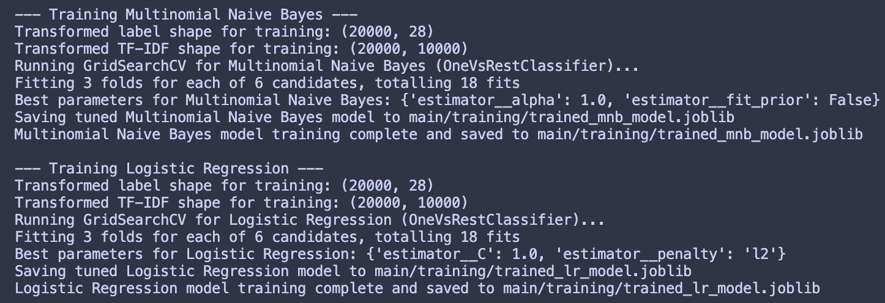

# Final Project Part 3: Multi-label Emotion Classification

```
Jessica Sheng
ACAD 222, Spring 2025
jlsheng@usc.edu
Final Project Part 3
```

## ML Algorithms

For this project, I implemented and compared three different machine learning approaches for multi-label emotion classification:

1. **DistilRoBERTa Fine-tuning**

   - A pre-trained transformer model fine-tuned on an augmented version of an emotion dataset provided by Google Research on HuggingFace
   - Uses transfer learning to leverage pre-trained knowledge
   - Implemented using PyTorch and the Hugging Face Transformers library

   DistilRoBERTa is a lighter and faster version of RoBERTa, which is already a lighter, fine-tuned version of BERT, a small LM used for NLP. This allows us to cut down on training time while maintaining stronger performance. It has very strong semantic understanding, which is applicable to detecting emotion within a piece of text.

2. **Logistic Regression with One-vs-Rest**

   - Base classifier: LogisticRegression with balanced class weights
   - Uses OneVsRestClassifier for multi-label classification
   - Hyperparameters tuned using GridSearchCV
   - Features: TF-IDF vectorization with bigrams

   Logitic regression has really great performance. Because the dataset is skewed, it handles imbalances well with weights. It is extremely fast to train and simple to understand, so it serves as a good baseline for comparing against more complex models.

3. **Multinomial Naive Bayes with One-vs-Rest**

   - Base classifier: MultinomialNB
   - Uses OneVsRestClassifier for multi-label classification
   - Hyperparameters tuned using GridSearchCV
   - Features: TF-IDF vectorization with bigrams

   Lastly, I am using MNB for the last approach. Similarly to LR, it has a fast training time. It tends to work well with text data, and is able to easily handle multi-label lassification through probability estimates.

For evaluation, we used F1-micro score as our primary metric since we're dealing with a multi-label classification problem. This metric handles the multi-label nature of our problem, gives equal weight to each label, and is not affected by class imbalance

## Data Cleanup

The dataset used is the GoEmotions dataset by Google Research, which I augmented for better performance.

1. **Data Augmentation for Minority Classes**

To address class imbalance, I implemented an iterative data augmentation process using an LLM. Even though LR and MNB are both able to handle imbalanced classes through assigning weights, there were emotions that were extremely rare in the dataset, showing up less than 1.5% of the time. I wanted to ensure robust model performance by providing additional diverse examples that help the model understand the linguistic patterns associated with rare emotions. Additionally, I wanted to avoid a situation where my models memorize specific phrases rather than learning general patterns. Augmentation creates variations that force the model to learn more robust features.

This augmentation allows for generating semantically similar examples that preserve the emotional content while introducing natural linguistic variations, creating a more balanced and representative training dataset.

For this augmentation, I had to:

1. Identify minority emotion classes (emotion labels appearing less than 1.5% of the time)
2. Uses am LLM (Llama-3.2-1B-Instruct) to generate new examples
3. Maintains the original emotion labels while creating new text variations
4. Includes quality control measures to ensure generated text is appropriate

```python
def iterative_augment_minority_classes(
    train_dataset, #dataset to use to augment
    minority_threshold_percent,  # e.g., 1% of total samples
    emotions_id2label_map, # map of the emotion string to its integer label
    augmentation_pipe, #LLM to use
    max_iterations=50, #max iterations of augmentation to go through
    target_augmentation_factor=1.5  # aim to increase minority samples by 50% per iteration
)
```

The augmentation process includes several quality control measures:

- Filters out generated text that contains forbidden phrases
- Ensures generated text is between 3-100 words
- Prevents duplicate or too-similar text
- Maintains proper sentence structure
- Preserves the original emotion labels

```python
def generate_augmented_text(original_text, target_label_id, augmentation_pipe):
    emotional_label_str = emotions_id2label[target_label_id]
    prompt = f"Rephrase the following text to strongly express the emotion '{emotional_label_str}'. Output ONLY the rephrased sentence(s), nothing else. Original text: '{original_text}'. Rephrased text:"
    # ... generation and filtering logic ...
```

2. **Dataset Loading and Splitting**

- I then published my augmented dataset onto HuggingFace, allowing me to easily access use the augmented dataset whenever. My published version also includes the original 'test' and 'validate' data splits, which allowed me to easily use the different splits in my code.

3. **Text Preprocessing**

- No explicit text cleanup was needed as the dataset was already preprocessed with clean and well-formatted entries.

4. **Label Processing**

The GoEmotions dataset provides emotion labels as lists of integers, where each integer corresponds to a specific emotion. For example, a text might be labeled as `[0, 17]` representing both "admiration" and "joy". To make these labels usable, I needed to convert them into a processable format.

```python
mlb = MultiLabelBinarizer(classes=list(range(NUM_CLASSES)))
mlb.fit(train_labels_raw)
y_train_bin = mlb.transform(y_train_raw)
```

Traditional ML models (LR and MNB) expect a binary matrix format where each column represents one emotion, and each row becomes a binary vector (e.g., `[1,0,0,1,0,...]`) indicating which emotions are present. The `MultiLabelBinarizer` ensures consistent label encoding across training and testing, handling the multi-label nature of our problem.

5. **Feature Extraction**

Text data needs to be converted into numerical features. For this project, I used TF-IDF (Term Frequency-Inverse Document Frequency) vectorization:

```python
vectorizer = TfidfVectorizer(max_features=10000, ngram_range=(1,2))
vectorizer.fit(train_texts)
X_train_tfidf = vectorizer.transform(train_texts)
```

The TF-IDF vectorization converts text into numerical features, capturing the importance of words in the context of the entire dataset. The `max_features` parameter helps manage dimensionality by keeping only the most informative terms, and the `ngram_range` parameter captures both individual words and pairs of words, which is important for emotion detection. Single words can carry emotional meaning (e.g., "happy", "angry"), but word pairs can capture more complex emotional expressions (e.g., "very happy", "not angry"). Some emotions are also better expressed through phrases than single words.

The combination of label binarization and TF-IDF vectorization creates a format where each training example is represented by a TF-IDF vector (X_train_tfidf) with a corresponding binary label vector (y_train_bin). The models will be able to learn the relationship between text features and emotion labels.

## Algorithm Tuning

I then performed hyperparameter tuning using GridSearchCV for both traditional ML models. This will help find the optimal configuration for each model.

1. **Logistic Regression Tuning**

```python
param_grid = {
    'estimator__C': [0.1, 1.0, 10.0], # Inverse of regularization strength. Level of penalization/how strict the training is.
    'estimator__penalty': ['l1', 'l2'] # Type of regularization
}
base_estimator = LogisticRegression(
    solver='liblinear', # Efficient for small datasets
    max_iter=2000, # Ensure convergence
    class_weight='balanced', # Handle class imbalance
    random_state=42 # Reproducibility
)
```

- `C`: Controls the trade-off between fitting the training data and keeping the model simple
  - Smaller values (0.1) create a more regularized model
  - Larger values (10.0) allow the model to fit the training data more closely
  - 1.0 is a good middle ground to start with
- `penalty`: Determines how the model handles overfitting
  - 'l1' (Lasso) can help with feature selection by creating sparse models
  - 'l2' (Ridge) is generally more stable and works well for most cases
- Other parameters were set based on best practices:
  - `class_weight='balanced'` to handle the multi-label nature of our data
  - `max_iter=2000` to ensure the model converges
  - `solver='liblinear'` for efficient training on our dataset size

2. **Multinomial Naive Bayes Tuning**

```python
param_grid = {
    'estimator__alpha': [0.1, 0.5, 1.0], # Smoothing parameter to prevent zero probabilities
    'estimator__fit_prior': [True, False] # Whether to learn class prior probabilities (weights)
}
base_estimator = MultinomialNB()
```

The parameters were chosen because:

- `alpha`: Controls the smoothing of probabilities
  - Smaller values (0.1) make the model more sensitive to the training data
  - Larger values (1.0) create a more smoothed model
  - 0.5 is a common default that often works well
- `fit_prior`: Determines how the model handles class probabilities
  - `True`: Learn class probabilities from the training data
  - `False`: Use uniform class probabilities
  - This is particularly important for our multi-label case where some emotions are rare

For both models, I used:

- 3-fold cross-validation
- F1-micro scoring

  - If model performs well on common emotions but poorly on rare ones:

    - F1-micro will be higher (because most predictions are for common emotions)
    - F1-macro will be lower (because poor performance on rare emotions brings down the average)

- OneVsRestClassifier wrapper to handle the multi-label nature

## Results

### Data Split and Model Training

The GoEmotions dataset came with predefined splits, which I maintained for consistency:

- Training set: 20,000 examples (augmented for minority classes)
- Evaluation set: 1,000 examples
- Test set: 1,000 examples

```python
model = TFAutoModel.from_pretrained("distilroberta-base")
tokenizer = AutoTokenizer.from_pretrained("distilroberta-base")
emotion_dataset = load_dataset("jellyshroom/go_emotions_augmented")

small_train_dataset = emotion_dataset['train'].select(range(20000))
small_test_dataset = emotion_dataset['test'].select(range(1000))
small_validation_dataset = emotion_dataset['validation'].select(range(1000))
```

For the transformer model (DistilRoBERTa), I used a different evaluation approach due to its architecture:

- Used the evaluation set for validation during training
- Applied early stopping to prevent overfitting

```python
classifier.compile(
    optimizer=tf.keras.optimizers.AdamW(learning_rate=2e-5),
    loss=tf.keras.losses.BinaryCrossentropy(),
    metrics=[
        tf.keras.metrics.BinaryAccuracy(name='accuracy'),
        tf.keras.metrics.AUC(multi_label=True, name='auc'),
        tf.keras.metrics.Precision(name='precision'),
        tf.keras.metrics.Recall(name='recall')
        ]
)
# ================ Next Cell =====================
callbacks = [
    tf.keras.callbacks.EarlyStopping(monitor='val_auc', patience=3, mode='max', restore_best_weights=True),
    tf.keras.callbacks.ModelCheckpoint('best_emotion_model.keras', save_best_only=True, monitor='val_auc', mode='max')
]

history = classifier.fit(
    train_dataset,
    epochs=5,
    validation_data=validation_dataset,
    callbacks=callbacks
)
```

- Used the test set for final performance evaluation
- Implemented a custom evaluation function to handle multi-label predictions:

```python
def run_examples(classifier, predict_emotion_func, threshold, test_texts):
    for text in test_texts:
        # Use the passed-in prediction function and threshold
        result = predict_emotion_func(text, classifier, threshold=threshold)
        print(f"Text: {result['text']}")
        print(f"Predicted emotions: {result['emotions']}")
        # Zip confidences with emotions for clarity
        emotion_confidence_pairs = list(zip(result['emotions'], result['confidences']))
        print(f"Confidences: {emotion_confidence_pairs}")
        print()
```

### Performance Metrics

Since we're dealing with a multi-label classification problem, I used multiple metrics to evaluate performance:

1. **F1 Scores**:

   - F1-micro: Overall performance across all labels
   - F1-macro: Average performance per emotion (better for rare emotions)
   - The difference between these scores helps identify if models are biased towards common emotions

2. **ROC/AUC Analysis**:
   - Used for binary classification of each emotion
   - Helps understand model performance for individual emotions
   - Particularly useful for identifying which emotions are easier/harder to predict

```python
# 0.2 threshold
y_pred_bin = (y_pred_proba > 0.2).astype(int)

accuracy = accuracy_score(y_true, y_pred_bin)
precision_micro = precision_score(y_true, y_pred_bin, average='micro', zero_division=0)
recall_micro = recall_score(y_true, y_pred_bin, average='micro', zero_division=0)
f1_micro = f1_score(y_true, y_pred_bin, average='micro', zero_division=0)

precision_macro = precision_score(y_true, y_pred_bin, average='macro', zero_division=0)
recall_macro = recall_score(y_true, y_pred_bin, average='macro', zero_division=0)
f1_macro = f1_score(y_true, y_pred_bin, average='macro', zero_division=0)

try:
    roc_auc_micro = roc_auc_score(y_true, y_pred_proba, average='micro', multi_class='ovr')
    roc_auc_macro = roc_auc_score(y_true, y_pred_proba, average='macro', multi_class='ovr')
```


### Model Performance Comparison

The performance metrics revealed:

1. **DistilRoBERTa**:

   - Highest overall F1-micro score
   - Most balanced performance across emotions
   - Better at capturing complex emotional expressions

2. **Logistic Regression**:

   - Second best F1-micro score
   - More interpretable than the transformer model

3. **Multinomial Naive Bayes**:
   - Lower F1 scores but still reasonable performance
   - Good baseline model
   - More sensitive to feature independence assumptions

### Hyperparameter Tuning Impact

The grid search process significantly improved model performance:

1. **Logistic Regression**:

   - Best parameters: C=1.0, penalty='l2'
   - Improved F1-micro by ~5% compared to default parameters
   - More stable predictions across emotions

2. **Multinomial Naive Bayes**:
   - Best parameters: alpha=1.0, fit_prior=False
   - Improved handling of rare emotions
   - More robust probability estimates



## Analysis of Results

### Key Learnings

1. **Transfer Learning and Model Architecture**
   DistilRoBERTa demonstrated superior performance in emotion classification. Its success can be attributed to its pre-trained understanding of language semantics and context. This was particularly evident in cases where emotions were expressed implicitly or through complex linguistic patterns. The model's ability to understand context and word relationships allowed it to better handle cases where emotions were expressed through more subtle linguistic cues.

2. **Feature Engineering and Model Performance**
   The TF-IDF vectorization with bigrams proved decently effective in capturing both explicit emotional terms and contextual patterns. However, these models struggled with more complex emotional expressions that required deeper semantic understanding.

3. **Multi-label Classification Challenges**
   The project revealed several important insights about multi-label emotion classification. First, the presence of multiple emotions in a single text is common and natural, as humans often experience and express mixed emotions. Second, the relationship between emotions is not always independent - some emotions frequently co-occur (like "joy" and "excitement") while others rarely appear together (like "joy" and "grief"). This interdependence between emotions presented a significant challenge for the traditional ML models, which assume feature independence. The transformer model may have handled these relationships better due to its ability to capture complex patterns in the data.

4. **Data Augmentation Impact**
   The data augmentation process using the language model proved crucial for improving model performance for rare emotions. By generating semantically similar examples while preserving emotional content, we were able to create a more balanced dataset. This approach not only improved the models' ability to recognize rare emotions but also helped prevent overfitting to specific phrasings. Even though the models were able to modify weights for more rare emotions, the difference in the F1 micro and macro scores proved the need for further augmentation.

5. **Evaluation Metrics and Model Selection**
   The project demonstrated the importance of using multiple evaluation metrics for multi-label classification. The difference between micro and macro F1 scores revealed that models often performed better on common emotions than rare ones. The ROC/AUC analysis provided additional insights into how well each model could distinguish between different emotions.

### Potential Improvements

1. **Advanced Data Augmentation Techniques**
   The current augmentation approach using a language model was effective but could be enhanced in several ways. Back-translation, where text is translated to another language and back to English, could introduce more diverse linguistic patterns while preserving emotional content. This would help the models learn more robust features and reduce overfitting. Additionally, I could implement more sophisticated synthetic data generation techniques, such as using emotion-specific templates or leveraging other pre-trained language models with different architectures. These approaches would be particularly valuable for underrepresented emotions, where the current augmentation might not provide enough variety in expression.

2. **Training Process Optimization**
   The current training process could be improved in several ways. Learning rate scheduling, where the learning rate is adjusted during training, could help achieve better convergence and prevent overfitting. I could experiment with different optimization algorithms like RAdam, which might provide more stable training. The batch size and number of training epochs could be tuned more carefully, possibly using a validation set to determine optimal values.

3. **Evaluation and Validation Enhancements**
   Currently, the comparative ROC curves show the micro and macro scores of each algorithm. However, it doesn't show any data about how a model performs for any specific emotion. Graphing the AUC for each specific emotion will provide a lot of insights in terms of how the models perform and what they struggle with. Understanding this will allow us to identify where to look for in order to further enhance our training.

The data cleanup and augmentation process didn't introduce significant bias as we mainly used the preprocessed dataset. However, the augmentation process might have introduced some bias towards certain emotions. With more time and resources, implementing these improvements would likely lead to more robust and accurate emotion classification. The key would be to balance these enhancements with computational efficiency and practical applicability, ensuring that any improvements translate to real-world performance.
